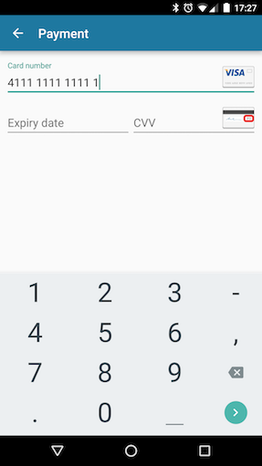

# judoNative SDK for Android

<p></p>

The judoNative Android library lets you integrate secure in-app card payments into your Android app. Judo's SDK enables a faster, simpler and more secure payment experience within your app. 

You can use our out of the box UI for a fully PCI Level 1 compliant payment experience that is customisable to match your app. Alternatively, you can also use the RESTful API directly to implement your own UI.

## Getting started
##### 1. Add the library to your project
If you're using Android Studio and Gradle, you can just add the android-sdk as a dependency in your app's build.gradle file:
```groovy
compile 'com.judopay:android-sdk:5.0'
```
##### 2. Initialise the SDK
From your app's main Activity class, or Application class, initialise the JudoPay SDK with your API token and secret:
```java
JudoPay.setup(this, "MY_API_TOKEN", "MY_API_SECRET", JudoPay.Environment.SANDBOX);
```
##### 3. Perform a test payment
To show the payment screen, create an Intent for the PaymentActivity with the required Intent extras:
```java
Intent intent = new Intent(activity, PaymentActivity.class);
intent.putExtra(JudoPay.JUDO_ID, "35843095834");
intent.putExtra(JudoPay.JUDO_AMOUNT, "13.37");
intent.putExtra(JudoPay.JUDO_CURRENCY, "GBP");
intent.putExtra(JudoPay.JUDO_CONSUMER, "consumerRef");
startActivityForResult(intent, requestCode);
```
##### 4. Check the payment result
In the Activity that calls the JudoPay SDK, override the ```Activity.onActivityResult``` method to receive the Receipt from the payment:
```java
@Override
protected void onActivityResult(int requestCode, int resultCode, Intent data) {
    super.onActivityResult(requestCode, resultCode, data);
    if(requestCode == PAYMENT_REQUEST) {
        switch (resultCode) {
            case JudoPay.RESULT_PAYMENT_SUCCESS:
                Receipt receipt = data.getParcelableExtra(JudoPay.JUDO_RECEIPT);
                // handle successful payment
      }
    }
}
```

## Latest changes

## Contributing

## License
See the [LICENSE](https://github.com/JudoPay/Judo-Android/blob/master/LICENSE) file for license rights and limitations (MIT).
